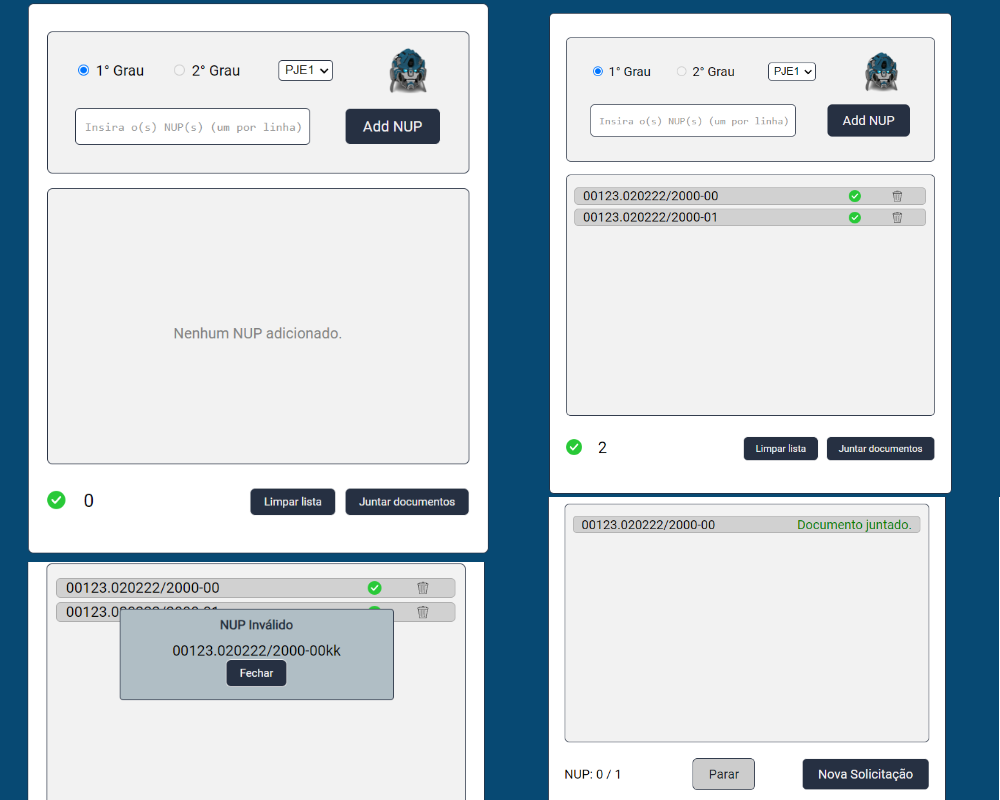

# Mirage Project Overview

Project developed to automate a process in the company. This is just an overview of the solution, since the real code can't be published.

## 👩🏾‍💻 Technologies

- HTML5 and CCS3
- Vanilla JavaScript
- NodeJS and NPM
- Axios
- Vite
- Python and Flask
- Git and Github

## Challenges
Some of the challenges and problems I overcame with this project:
*  User basic authentication, which was made using the username and password.
* Client side validation, which was handled with regular expressions.
* Multiple requests using async and axios.
* Modular JavaScript. Ex: [ApiHandler Module](script.js).
* All the data used in this overview is fictional.

> Login Screen

> Main and result pages

## ✉ Contact

contatolucioaraujo@gmail.com

[Linkedin](https://www.linkedin.com/in/lucioaraujo30/)